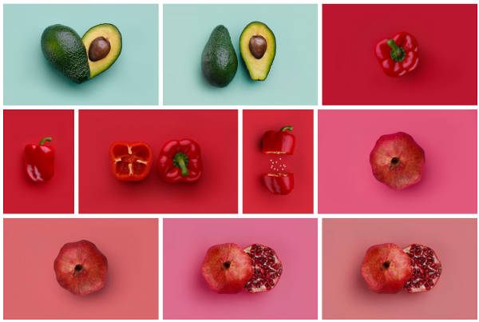

# Yallery

**Package is in alpha - production use is not recomended for now**
<br/><br/>
Yallery is [Ymage](https://github.com/ylfe-dev/Ymage) based react gallery component focused on advenced automation, smooth layout adjustments and fast image rendering even in "wild" situations when you can't provide image diemnsions before fetching them.


<p align="center">

</p>

✅ Advenced progressive JPEG recognition - image is rendered on first progressive scan avaiable - before `onLoad`.  <br/>
✅ Sized, neat image placeholder<br/>
✅ Short props for styling<br/>
✅ Image copy protection<br/>
✅ All image  formats are compatible - progressive JPEG is just recommended way<br/>

<br/>

## Installation


```shell
$ npm install yallery
```

Import module to `yourcode.js`:
```JavaScript
import Yallery from 'yallery'
```

<br/>

## Usage

### 1. Wild or controlled image list
Yallery can operate in two modes (depending on information provided with image url's): **controlled** and **wild**. If images are static gallery like photography portfolio - you should provide aspect ratio of each image to make Yallery even more smooth in render and adjusting. If you don't provide this information, Yallery will work in wild mode adjusting the layout when images are downloaded.

#### Wild list
```JavaScript
const images = ["apple.jpg", "orange.jpg", "grape.jpg" ... ]
```
Or with `alt`:
```JavaScript
const images = [
	{img: "apple.jpg",  alt:"Image with apple"}, 
	{img: "orange.jpg", alt:"Image with orange"}, 
	{img: "grape.jpg",  alt:"Image with grape"}, 
	... ]
```
#### Controlled list
```JavaScript
const images = [
	{img: "apple.jpg",  aspect:{w:3, h:2} }, 
	{img: "orange.jpg", aspect:{w:2, h:3} }, 
	{img: "grape.jpg",  aspect:{w:3, h:2} }, 
	... ]
```

<br/>

### 2. Yallery 
Yallery is ready to work with only `images` list provided, but what makes it unique is that you can create your custom layouts for specified viewport breakpoints - let's talk about this in next paragraph. Your Yallery is ready from built-in layout with: 
```JavaScript
<Yallery images={images} />
```

<br/>

### 3. Layout

There are two basic layout types: **columns** and **rows** *(**grid** layout is in development)*
```JavaScript
const custom = { layout:[
	{breakpoint: 0,    columns: 1},
	{breakpoint: 400,  columns: 2,           gap: 10 },
	{breakpoint: 800,  columns: [1.5, 1, 1], gap: 15 },
	{breakpoint: 1100, rows: 300,            gap: {x:10, y:15} },
	{breakpoint: 1600, columns: 5,           gap: 10}
]}

<Yallery images={images} options={custom} />
```


|Property|CSS|
|-|-|
|columns| Column layout can be a number of columns `columns: 3` or array with columns width ratio `columns: [1, 1.5, 1.3]` |
|rows|Row layout is described only with row height in pixels `row: 300`|
|gap|Gaps in px between images, can be a number `gap: 10` for both `x` and `y` or an object `gap: {x: 10, y:15}`|
|margin|Margin around gallery in px - usefull to provide some space from left/right border. Same as gap, can be number for both `x` and `y`  `margin: 50` or object `margin: {x:50, y:0}` |


<br/>
